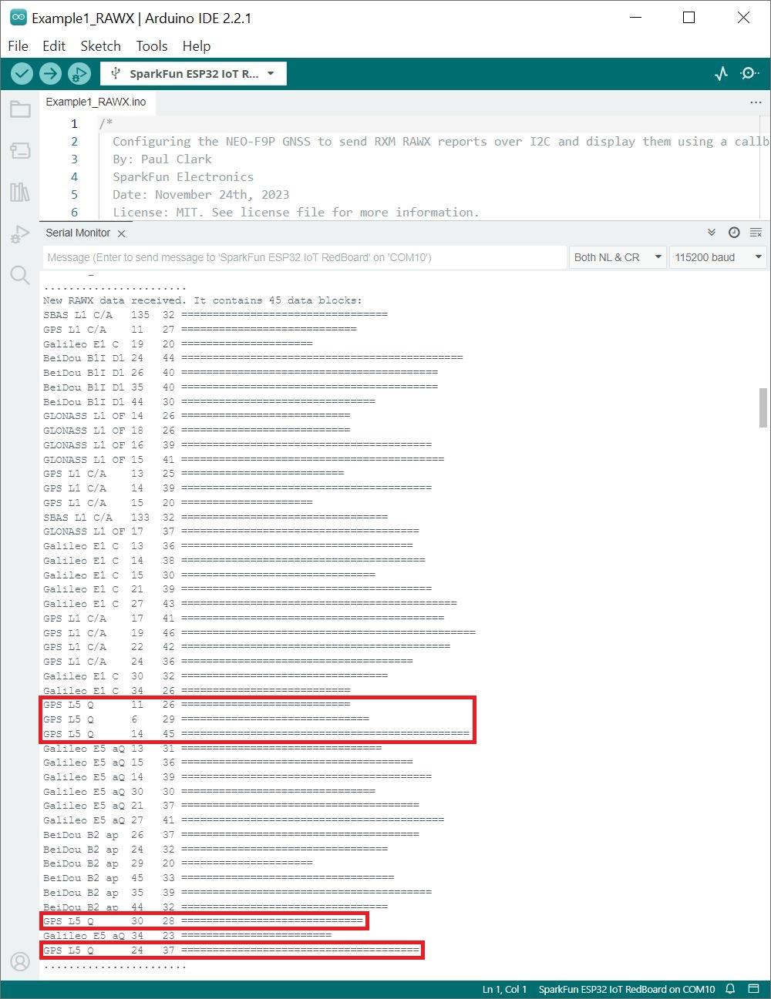
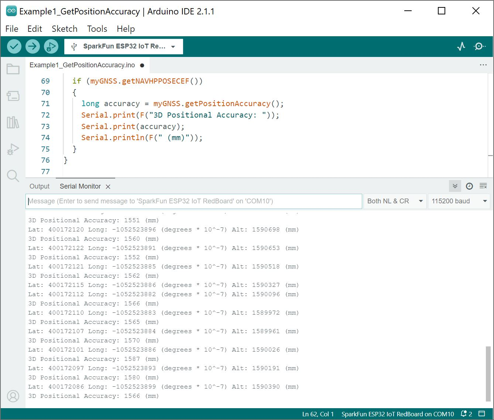

Now that we have our library and board add-on installed, we can get start experimenting with the breakout board. For the scope of this tutorial, we will highlight one of the examples to get started. From there we will be able to build our own custom code to integrate the development board into a project.


### Example 1: RAWX

This example shows how to configure the NEO-F9P GNSS for L5 band and overriding the health status. The output will indicating the type of signals that the NEO-F9P is receiving. Head to the example in the **NEO-F9P** folder (located in **File** **Examples** > **SparkFun u-blox GNSS V3** > **NEO-F9P** > **Example1_RAWX**).

If you have not already, select your Board (in this case the **SparkFun ESP32 IoT RedBoard**), and associated COM port. Upload the code to the board and set the [Arduino Serial Monitor](https://learn.sparkfun.com/tutorials/terminal-basics/all#arduino-serial-monitor-windows-mac-linux) to **115200** baud. Give the NEO-F9P a few minutes to get a satellite lock.

<div style="text-align: center;">
  <table>
    <tr style="vertical-align:middle;">
     <td style="text-align: center; vertical-align: middle;"><a href="../assets/img/NEO-F9P_L5_Arduino_Output_Highlighted.jpg"></a></td>
    </tr>
  </table>
</div>

The signals available will be output in the Serial Monitor. If everything goes well, you should see some L5 signals (highlighted in red).


### Example 1: Get Position Accuracy

!!! note
    Make sure that you are in the correct folder! These examples are in the ZED-F9P folder instead of the NEO-F9P folder.

As a quick test to see if we are getting coordinates and how accurate the values are, we will be using the first example in the **ZED-F9P** folder (located in **File** **Examples** > **SparkFun u-blox GNSS V3** > **ZED-F9P** > **Example1_GetPositionAccuracy**). The example in this tutorial is technically the second one but we numbered the example based on the one that is within the **ZED-F9P** folder.

As stated in the note in the previous section and example, you will need to enable the L5 band, override the health status, save the configuration, and power cycle the NEO-F9P. In the `setup()` function, make sure to include the following three lines after connecting to the NEO-F9P.

``` c
  //Add the following 3 lines below to enable L5 band and override health status check on the NEO-F9P
  myGNSS.setVal8(UBLOX_CFG_SIGNAL_GPS_L5_ENA, 1); // Make sure the GPS L5 band is enabled (needed on the NEO-F9P)

  myGNSS.setGPSL5HealthOverride(true); // Mark L5 signals as healthy - store in RAM and BBR

  myGNSS.softwareResetGNSSOnly(); // Restart the GNSS to apply the L5 health override
```

If you have not already, select your Board (in this case the **SparkFun ESP32 IoT RedBoard**), and associated COM port. Upload the code to the board and set the [Arduino Serial Monitor](https://learn.sparkfun.com/tutorials/terminal-basics/all#arduino-serial-monitor-windows-mac-linux) to **115200** baud. Give the NEO-F9P a few minutes to get a satellite lock. The GPS coordinates and the accuracy will be output in the Serial Monitor.

<div style="text-align: center;">
  <table>
    <tr style="vertical-align:middle;">
     <td style="text-align: center; vertical-align: middle;"><a href="../assets/img/NEO-F9P_Arduino_Output_without_Correction_Source.JPG"></a></td>
    </tr>
  </table>
</div>

To increase accuracy, you will need to feed correction data from a correction source. Make sure to check the examples and tutorials linked in the next section.


### More Examples!

Now that you got it up and running, check out the other examples located in the ZED-F9P folder!

<div style="text-align: center"><a href="https://github.com/sparkfun/SparkFun_u-blox_GNSS_v3/tree/main/examples/ZED-F9P" target="github_gnss_v3" class="md-button">SparkFun_u-blox_GNSS_v3 > examples > ZED-F9P</a></div>

Of course, to get the most out of the NEO-F9P, you will need an RTCM correction source. Depending on your setup, you will probably need a second NEO-F9P for a correction source. The following project tutorials allow you to set up the ZED-F9P as a reference station or rover.

<div class="grid cards hide col-4" markdown>
<!-- ----------WHITE SPACE BETWEEN GRID CARDS---------- -->
-   <a href="https://learn.sparkfun.com/tutorials/1363">
      <figure markdown>
        
      </figure>
    </a>

    ---

    <a href="https://learn.sparkfun.com/tutorials/1363">
      <b>How to Build a DIY GNSS Reference Station</b>
    </a>
<!-- ----------WHITE SPACE BETWEEN GRID CARDS---------- -->
-   <a href="https://learn.sparkfun.com/tutorials/1363">
      <figure markdown>
        
      </figure>
    </a>

    ---

    <a href="https://learn.sparkfun.com/tutorials/1363">
      <b>Setting up a Rover Base System</b>
    </a>
<!-- ----------WHITE SPACE BETWEEN GRID CARDS---------- -->
