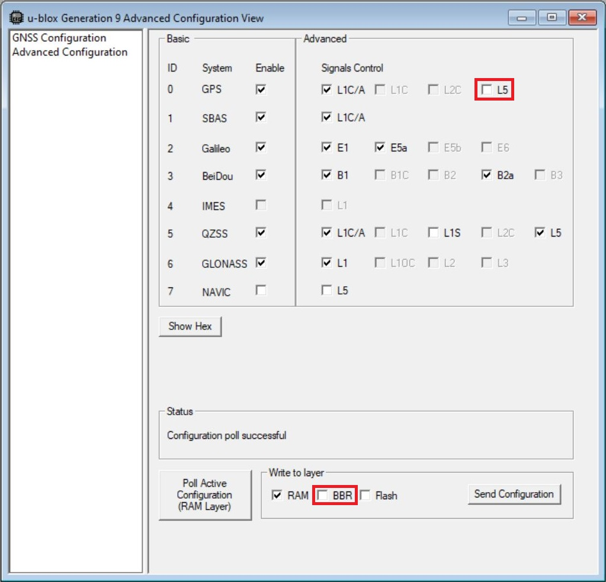
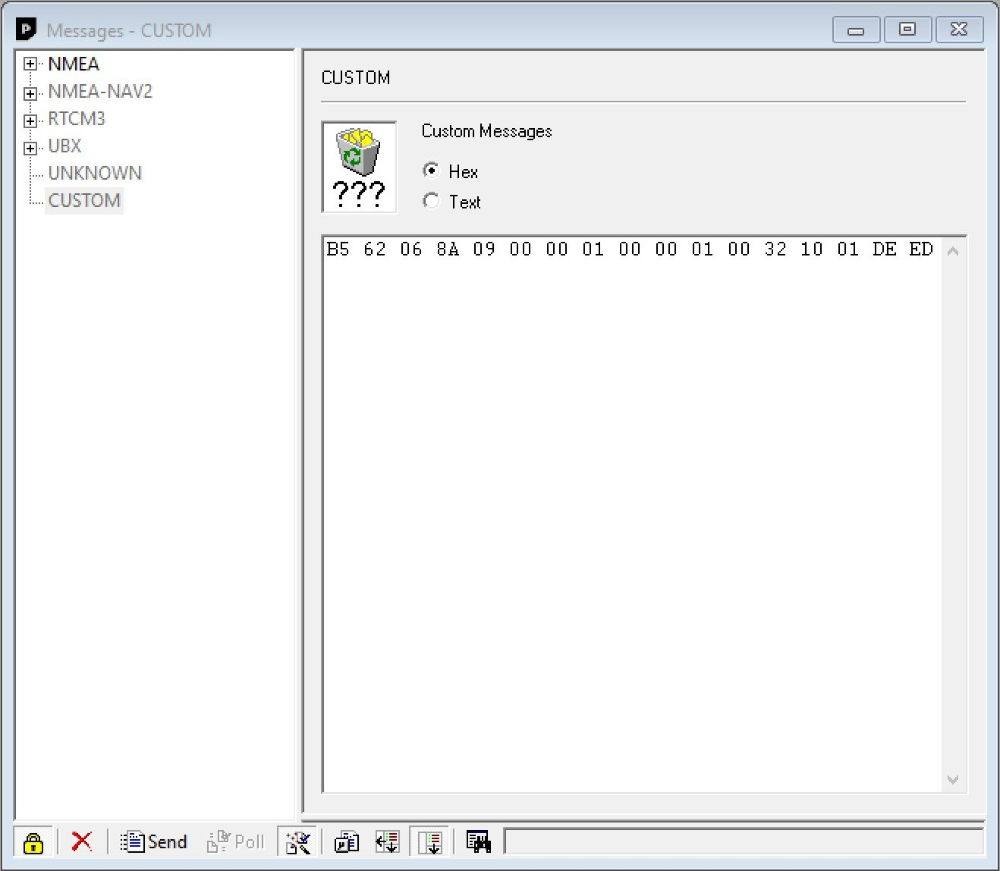
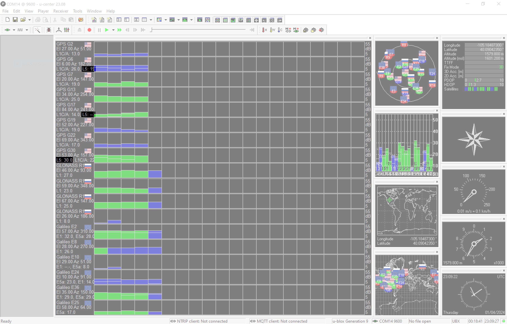

By default, the L5 band is disabled on the NEO-F9P. To take advantage of the L5 band, you will need to:

* enable the L5 band
* override the health status check
* save the settings into memory
* perform a software reset


### Configuring with the Arduino Library

!!! arduino
    Make sure that you are using the SparkFun u-blox GNSS Arduino Library **v3.1.1+** in order to be able to take advantage of the following functions.

To do this using the Arduino Library, users can add the following three lines of code in the `setup()` function after connecting a Qwiic cable between an Arduino to the NEO-F9P:

```c
  if (myGNSS.begin() == false) //Connect to the u-blox module using Wire port
  {
    Serial.println(F("u-blox GNSS not detected at default I2C address. Please check wiring. Freezing."));
    while (1);
  }

  myGNSS.setI2COutput(COM_TYPE_UBX); //Set the I2C port to output UBX only (turn off NMEA noise)
  //myGNSS.saveConfiguration(); //Optional: Save the current settings to flash and BBR

  //Add the following 3 lines below to enable L5 band and override health status check on the NEO-F9P
  myGNSS.setVal8(UBLOX_CFG_SIGNAL_GPS_L5_ENA, 1); // Make sure the GPS L5 band is enabled (needed on the NEO-F9P)

  myGNSS.setGPSL5HealthOverride(true); // Mark L5 signals as healthy - store in RAM and BBR

  myGNSS.softwareResetGNSSOnly(); // Restart the GNSS to apply the L5 health override
```


### Configuring with U-Center

Users can also enable the L5 band via U-Center v22.07. Connect a USB cable between the NEO-F9P breakout board and your computer. Then open the software, connect to the COM port that the board enumerated to, and head to **View** > **Generation 9 Configuration View**. Once open, select the check box for GPS's **L5**. Select the check box for **BBR**. When ready, hit the **Send Configuration** button.

<div style="text-align: center;">
  <table>
    <tr style="vertical-align:middle;">
     <td style="text-align: center; vertical-align: middle;"><a href="../assets/img/Enable_L5_Band_Highlighted_u-center.JPG"></a></td>
    </tr>
  </table>
</div>

To override the health status by heading to **View** > **Messages View** > **CUSTOM**. With the Custom Messages set for **Hex**, paste the following to configure the settings in **RAM** and hit the send button:

``` bash
B5 62 06 8A 09 00 00 01 00 00 01 00 32 10 01 DE ED
```

<div style="text-align: center;">
  <table>
    <tr style="vertical-align:middle;">
     <td style="text-align: center; vertical-align: middle;"><a href="../assets/img/U-Center_Override_Health_StatusL5_RAM.JPG"></a></td>
    </tr>
  </table>
</div>


Then send the following to configure the settings in **BBR** and hit the send button:

``` bash
B5 62 06 8A 09 00 00 02 00 00 01 00 32 10 01 DF F5
```

<div style="text-align: center;">
  <table>
    <tr style="vertical-align:middle;">
     <td style="text-align: center; vertical-align: middle;"><a href="../assets/img/U-Center_Override_Health_Status_L5_BBR.JPG"></a></td>
    </tr>
  </table>
</div>

!!! tip
    To confirm that the above UBX messages were sent successfully, check the `UBX-ACK-ACK` messages after sending the message. For users that want to revert to the default behavior, make sure to check the **[GPS L5 Configuration: GNSS receiver handling of GPS L5 health status](http://127.0.0.1:8000/SparkFun_u-blox_NEO-F9P/assets/component_documentation/GPS-L5-configuration_AppNote_UBX-21038688.pdf)** application note on page 5 under *Table 2: UBX binary strings to revert the GPS L5 health status monitoring to default*.

The "Satellite Level History" window should update and include the L5 bands if it is available.

<div style="text-align: center;">
  <table>
    <tr style="vertical-align:middle;">
     <td style="text-align: center; vertical-align: middle;"><a href="../assets/img/U-Center_L5_Band_Satellite_Level_History_Highlighted.JPG"></a></td>
    </tr>
  </table>
</div>
