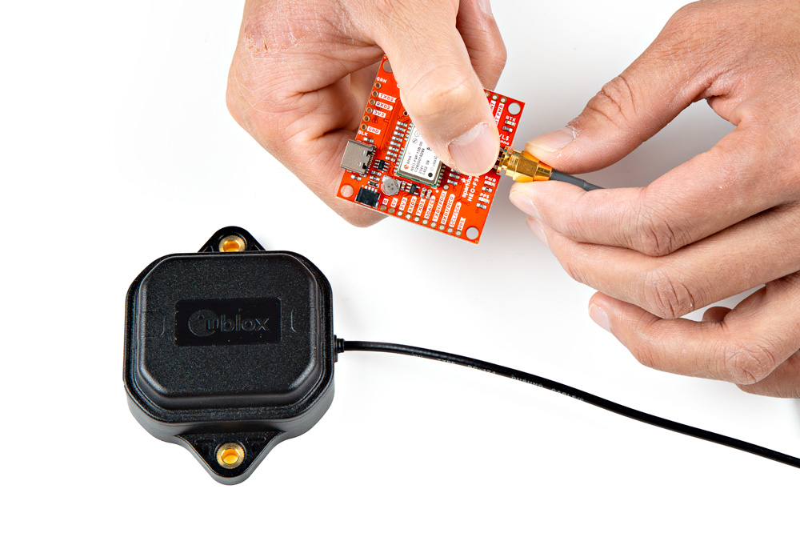
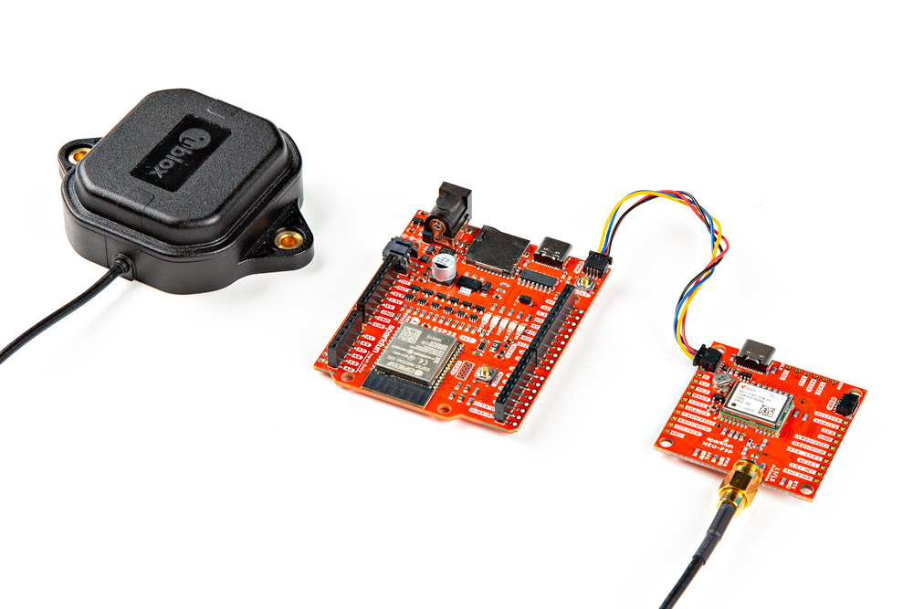
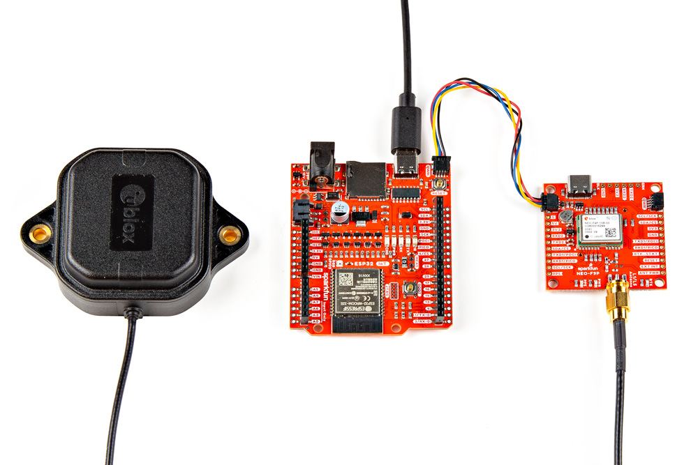
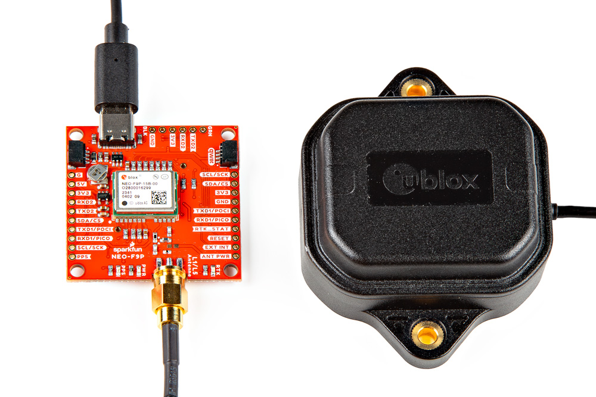

In this section, we'll go over how to connect the L1/L5 GNSS Antenna, SparkFun Qwiic GNSS-RTK L1/L5 Breakout - NEO-F9P, and IoT RedBoard - ESP32 for embedded systems. Of course, you can also connect the NEO-F9P directly to your computer without the need for a microcontroller if you decide to use the u-blox u-center software as well.

### L1/L5 Dual-Band GNSS Antenna

Connect a compatible dual-band antenna that is capable of receiving L1 and L5 bands. In this case, we used the "GNSS L1/L5 Multi-Band High Precision Antenna - 5m (SMA)."  Insert the TNC side of the interface cable into the antenna's TNC connector. Secure the connection by tightening the screw until it is finger-tight. Then insert the SMA side of the interface cable into the GNSS-RTK L1/L5 Breakout Board's SMA connector. Secure the connection by using the SMA's hex nut until it is finger-tight.

  <table>
    <tr style="vertical-align:middle;">
     <td style="text-align: center; vertical-align: middle;"></td>
    </tr>
  </table>

You will need to include an [antenna ground plate](https://www.sparkfun.com/products/17519) to get the most of the multi-band antenna. For the following images below, we'll have the magnetic mount antenna separate from the antenna ground plate when connecting the NEO-F9P breakout board to the rest of the system. When running the examples, make sure to have the antenna mounted over a metal ground plate.

  <table>
    <tr style="vertical-align:middle;">
     <td style="text-align: center; vertical-align: middle;"></td>
    </tr>
  </table>

!!! note
    Not all multiband antennas are made the same! Make sure that you are connecting a multi-band antenna that is capable of receiving L1/L5 signals when using the SparkFun Qwiic GNSS-RTK L1/L5 Breakout - NEO-F9P. There is also another u-blox antenna that looks the same. However, the u-blox antenna used in this tutorial receives L1/L5 signals as opposed to the L1/L2.

### Connecting via Qwiic Port

!!! note
    We recommend using the IoT RedBoard - ESP32 for the scope of this tutorial.

For this example, we will use the IoT RedBoard - ESP32 and its associated cable. Connecting the boards with a Qwiic cable is very simple. Plug a Qwiic cable between the RedBoard IoT and the SparkFun NEO-F9P. If you're going to be soldering to the through hole pins, then just attach lines to power, ground, and the I2C data lines to the microcontroller of your choice.

  <table>
    <tr style="vertical-align:middle;">
     <td style="text-align: center; vertical-align: middle;"></td>
    </tr>
  </table>

### USB to Microcontroller

To power and program the IoT RedBoard - ESP32, users will just need to insert the Type C side of the cable to the development board. The other end will connect to a computer's USB port.

  <table>
    <tr style="vertical-align:middle;">
     <td style="text-align: center; vertical-align: middle;"></td>
    </tr>
  </table>

### USB to NEO-F9P

For users that simply want to connect to the board via USB, you will insert a USB C cable into the USB connector. Then connect the other end to your computer USB port.

  <table>
    <tr style="vertical-align:middle;">
     <td style="text-align: center; vertical-align: middle;"></td>
    </tr>
  </table>

### Connecting via PTH

For temporary connections to the PTHs, you could use IC hooks to test out the pins. However, you'll need to solder headers or wires of your choice to the board for a secure connection. You can choose between a combination of [header pins and jumper wires](https://learn.sparkfun.com/tutorials/how-to-solder-through-hole-soldering/all), or [stripping wire and soldering the wire](https://learn.sparkfun.com/tutorials/working-with-wire/all) directly to the board.

-   <a href="https://learn.sparkfun.com/tutorials/how-to-solder-through-hole-soldering/all">
      <figure markdown>
        
      </figure>
    </a>

    ---

    <a href="https://learn.sparkfun.com/tutorials/how-to-solder-through-hole-soldering/all">
      <b>How to Solder: Through Hole Soldering</b>
    </a>
<!-- ----------WHITE SPACE BETWEEN GRID CARDS---------- -->

-   <a href="https://learn.sparkfun.com/tutorials/working-with-wire/all">
      <figure markdown>
        
      </figure>
    </a>

    ---

    <a href="https://learn.sparkfun.com/tutorials/working-with-wire/all">
      <b>Working with Wire</b>
    </a>
<!-- ----------WHITE SPACE BETWEEN GRID CARDS---------- -->

