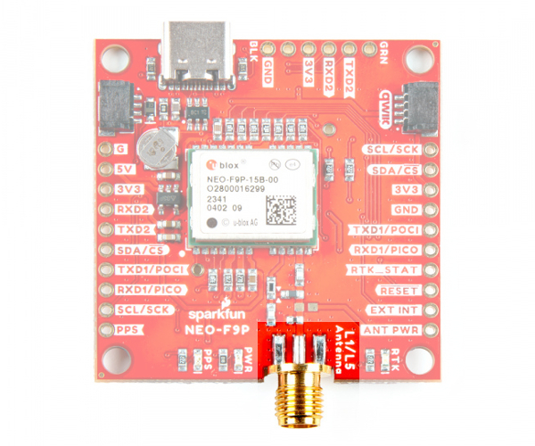

In this section, we will highlight the hardware and pins that are broken out on the SparkFun GNSS-RTK L1/L5 Breakout - NEO-F9P (Qwiic). For more information, check out our [Resources and Going Further](../resources/) for the NEO-F9P.

  <table>
    <tr style="vertical-align:middle;">
     <td style="text-align: center; vertical-align: middle; border: solid 1px #cccccc;""></td>
     <td style="text-align: center; vertical-align: middle; border: solid 1px #cccccc;""></td>
    </tr>
    <tr style="vertical-align:middle;">
     <td style="text-align: center; vertical-align: middle; border: solid 1px #cccccc;"><i>Top View</i></td>
     <td style="text-align: center; vertical-align: middle; border: solid 1px #cccccc;"><i>Bottom View</i></td>
    </tr>
  </table>

### NEO-F9P Module

The board breaks out the NEO-F9P.

  <table>
    <tr style="vertical-align:middle;">
     <td style="text-align: center; vertical-align: middle;"></td>
    </tr>
  </table>

Similar to the other F9P engines, the NEO-F9P is a 184-Channel GNSS Receiver. The module supports the concurrent reception of four GNSS systems: GPS, GLONASS, Galileo and BeiDou. The NEO-F9P is an upgrade to the [NEO-M8P](https://www.sparkfun.com/products/15005) and utilizes the L1/L5 bands as opposed to the [ZED-F9P](https://www.sparkfun.com/products/16481)'s L1/L2.

  <table>
    <tr style="vertical-align:middle;">
     <td style="text-align: center; vertical-align: middle;"></td>
    </tr>
    <tr style="vertical-align:middle;">
     <td style="text-align: center; vertical-align: middle;">Image Courtesy of <a href="../assets/component_documentation/GPS-signals-migration-wp.pdf">u-blox: GPS Signals Migration White Paper</a></td>
    </tr>
  </table>

Utilizing the L5 band, the NEO-F9P delivers improved performance under challenging urban environments because the L5 signals fall within the protected ARNS (aeronautical radionavigation service) frequency band. This band is less subject to RF interference. Below is a comparison of a single-band (L1) vs dual-band (L1/L5) GNSS test with a car driving through an urban environment. Tracking the vehicle was better when utilizing the L1/L5 bands.

  <table>
    <tr style="vertical-align:middle;">
     <td style="text-align: center; vertical-align: middle;"></td>
    </tr>
    <tr style="vertical-align:middle;">
     <td style="text-align: center; vertical-align: middle;"><i>Image Courtesy of <a href="../assets/component_documentation/GPS-signals-migration-wp.pdf">u-blox: GPS Signals Migration White Paper</a></i></td>
    </tr>
  </table>

!!! note
    As of the writing of this tutorial, it is important to note that L5 band is still not yet fully operational on GPS and Galileo. It is expected to be fully operational by 2025.

When a RTK solution is reached, the module can achieve a horizontal accuracy of about 10mm (~0.393 inches) and a vertical accuracy of about 10mm (~0.393 inches). The NEO-F9P is capable of both rover and base station operations. Below are a few specs taken from the datasheet. For more information, check out the related [documents for the NEO-F9P in the Resources](../resources/).

* Time to First Fix: 27s (cold), 3s (hot)
* Max Navigation Rate:
    * RTK (basic location over UBX binary protocol) - 25Hz
    * PVT - 25Hz
    * RAW - 25Hz
* Horizontal Position Accuracy:
    * 1.5m without RTK
    * 0.01m with RTK
* Vertical Position Accuracy:
    * 2.0m without RTK
    * 0.01m with RTK
* Time Pulse Accuracy: 30ns
* Operational Limits
    * Max G: &le;4G
    * Max Altitude: 80km (49.7 miles)
    * Max Velocity: 500m/s (1118mph)
* Software Configurable
    * Geofencing
    * Odometer
    * Spoofing Detection
    * External Interrupt
    * Pin Control
    * Low Power Mode
    * Many others!
* Supports NMEA, UBX, RTCM, SPARTN, CLAS protocols over UART or I2C interfaces

### Power

There are a variety of power and power-related nets broken out to connectors and through hole pads. **5V** power from the USB C Connector or PTH is regulated down to **3.3V** with the AP2112K 3.3V/600mA voltage regulator. The logic levels for the NEO-F9P is **3.3V** for the I/O pins.

* **5V** &mdash; Power from the USB C connector's VBUS provides power to the 5V bus. The 5V net is also connected to the edge PTH pin labeled as **5V** and the input of the 3.3V voltage regulator. Care must be taken when connecting to this pin to avoid conflicting voltages between the breakout board and anything connect to the 5V pin. Make sure that power you provide to this pin does not exceed 6 volts.
* **3V3** &mdash; This connects to the 3.3V net. Both sides of the board includes a 3.3V pin (labeled as 3V3) that should only be provided with a clean 3.3V power signal. This is also connected to the Qwiic connectors.
* **GND** &mdash; Of course, is the common, ground voltage (0V reference) for the system.

  <table>
    <tr style="vertical-align:middle;">
     <td style="text-align: center; vertical-align: middle;"></td>
    </tr>
  </table>

### Backup Battery

The small metal disk is a small lithium battery. This battery does not provide power to the IC like the 3.3V system does, but to relevant systems inside the IC that allow for a quick reconnection to satellites. The first time to fix (TTFF) is about **~27 seconds**. With the backup battery, the hot start is less than **3 seconds**.

  <table>
    <tr style="vertical-align:middle;">
     <td style="text-align: center; vertical-align: middle;"></td>
    </tr>
  </table>

### Qwiic and I2C

There are two PTHs labeled **SDA** and **SCL** on each side of the board. These indicate the I2C data and clock lines. These pins also have an alternative function for SPI: **CS** and **SCK**. By default, the I2C interface is enabled. As mentioned in the jumpers section, you'll need to keep the SPI jumper open on the underside for the I2C interface. We also conveniently added a GND and 3.3V pin on one side should you decide to daisy chain additional I2C devices to the PTH. Similarly, you can use either of the Qwiic connectors to provide power and utilize I2C. The [Qwiic ecosystem](https://www.sparkfun.com/qwiic) is made for fast prototyping by removing the need for soldering. All you need to do is plug a Qwiic cable into the Qwiic connector and voila!

* **SDA/CS** &mdash; I2C data / SPI Chip Select
* **SCL/SCK** &mdash; I2C clock / SPI Serial Clock

  <table>
    <tr style="vertical-align:middle;">
     <td style="text-align: center; vertical-align: middle;"></td>
    </tr>
  </table>

!!! note
    The only I2C address for this and all u-Blox GPS products is **0x42**, though each can have their address changed through software.

!!! tip
    There are jumpers for the I2C data and clock lines. By default, these jumpers are open. Closing the jumpers will add [2.2k&ohm; pull-up resistors to the I2C bus](https://learn.sparkfun.com/tutorials/i2c/all#i2c-at-the-hardware-level). For users that do not have pull-up resistors attached to the I2C lines on their microcontroller, make sure to close the jumpers with a little solder blob.

### UART1

There are two pins on each row of headers currently labeled as **TXD1** and **RXD1** for the primary UART. These pins also have an alternative function for SPI: **POCI** and **PICO**. By default, the UART interface is enabled. Be sure that the SPI jumper on the back of the board is open.

* **TXD1/POCI** &mdash; TX out from NEO-F9P / SPI Peripheral Out Central In
* **RXD1/PICO** &mdash; RX into NEO-F9P / SPI Peripheral In Central Out

  <table>
    <tr style="vertical-align:middle;">
     <td style="text-align: center; vertical-align: middle;"></td>
    </tr>
  </table>

### UART2

There is a second serial port available on the NEO-F9P. This is primarily used for RTCM3 correction data. By default, this port will automatically receive and parse incoming RTCM3 strings enabling RTK mode on the board like the other RTK breakout boards for the NEO-M8P-2 and ZED-F9P. The RTCM Correction port pins are arranged to match the industry standard serial connection (aka the 'FTDI' pinout). This pinout is compatible with our [Bluetooth Mate](https://www.sparkfun.com/products/12576) and [Serial Basic](https://www.sparkfun.com/products/15096) so you can send RTCM correction data from a cell phone or computer. Note that RTCM3 data can also be sent over I2C, UART1, SPI, or USB if desired.

  <table>
    <tr style="vertical-align:middle;">
     <td style="text-align: center; vertical-align: middle;"></td>
    </tr>
  </table>

!!! note "What is a BlueSMiRF?"
    The BlueSMiRF was a Bluetooth device that was included in SparkFun's catalog. The footprint consists of a 1x6 header for the serial UART and power pins. Note that the arrangement of the header pins can be different from USB-to-serial converters (i.e. FTDI Serial Breakout Boards and CH340 Serial Basic Boards).

### SPI

There are four pins on the header that are labeled with their corresponding SPI functionality: **POCI**, **PICO**, <b>CS</b>, and **SCK**. These pins are shared with the UART and I2C pins. By default, the UART interface is enabled. As mentioned in the jumpers section, you'll need to close the **SPI** jumper on the underside to enable SPI interface. Note the board uses different terminology for SPI. For more information, make sure to check out our [SPI tutorial](https://learn.sparkfun.com/tutorials/serial-peripheral-interface-spi/all#receiving-data).

* **TXD1/POCI** &mdash; TX out from NEO-F9P / SPI Peripheral Out Central In
* **RXD1/PICO** &mdash; RX into NEO-F9P / SPI Peripheral In Central Out
* **SDA/CS** &mdash; I2C data / SPI Chip Select
* **SCL/SCK** &mdash; I2C clock / SPI Serial Clock

  <table>
    <tr style="vertical-align:middle;">
     <td style="text-align: center; vertical-align: middle;"></td>
    </tr>
  </table>

### SMA Connector

The board is populated with one SMA connector for a secure connection. You will need a multiband GNSS antenna capable of receiving L1 and L5 bands to get the most out of the NEO-F9P. Note that this is intended for active antennas. We recommend using the
[GNSS L1/L5 Multi-Band High Precision Antenna - 5m (SMA)](https://www.sparkfun.com/products/23814). You will also need an [antenna ground plate](https://www.sparkfun.com/products/17519)

  <table>
    <tr style="vertical-align:middle;">
     <td style="text-align: center; vertical-align: middle;"></td>
    </tr>
  </table>

### Antenna Power

The antenna power pin (**ANT PWR**) is available for advanced users that want to power their L1/L5 3.3V active antenna with an external power source.

  <table>
    <tr style="vertical-align:middle;">
    <td style="text-align: center; vertical-align: middle; border: solid 1px #cccccc;">
    </td>
  </table>

Follow the steps below to modify the board.

* **Isolate VCC_RF** &mdash; You will need to isolate the VCC_RF. Users will need to make sure to cut the trace between the two arrows (i.e. &#9654; &#9664;) to disable the VCC_RF antenna power. You can also shift the surface mount component that connects to the trace by moving it so that it does not connect to the SMA connector.
* **Install SMD Component** &mdash; You will then need to populate the board where L1 is located (i.e. the pads that are not currently populated and connects to the **ANT PWR** PTH) with a 0603 part with impedance >500 Ohms at 1.5GHz.
* **Inject Power** &mdash; When ready, connect a clean DC power supply voltage between **ANT PWR** and **GND**.

  <table>
    <tr style="vertical-align:middle;">
      <td style="text-align: center; vertical-align: middle; border: solid 1px #cccccc;">
      </td>
      <td style="text-align: center; vertical-align: middle; border: solid 1px #cccccc;">
      </td>
      <td style="text-align: center; vertical-align: middle; border: solid 1px #cccccc;">
      </td>
    </tr>
    <tr>
      <td style="text-align: center; vertical-align: middle; border: solid 1px #cccccc;"><i>Cut Trace VCC_RF</i></td>
      <td style="text-align: center; vertical-align: middle; border: solid 1px #cccccc;"><i>Install SMD Component</i></td>
      <td style="text-align: center; vertical-align: middle; border: solid 1px #cccccc;"><i>Inject Power to <b>ANT PWR</b></i></td>
    </tr>
  </table>

### Broken Out Pins

There are six  other pins broken out:

* **PPS** &mdash; Pulse-per-second output pin. Begins blinking at 1Hz when module gets basic GPS/GNSS position lock.
* **RTK_STAT** &mdash; Real Time Kinematic status output pin. Remains high when module is in normal GPS mode. Begins blinking when RTCM corrections are received and module enters RTK float mode. Goes low when module enters RTK fixed mode and begins outputting cm-level accurate locations.
* **RESET** &mdash; Reset input pin. Pull this line low to reset the module.
* **EXT INT** &mdash; Interrupt input/output pin. Can be configured using U-Center to bring the module out of deep sleep or to output an interrupt for various module states.
* **LNA_EN** &mdash; Antenna, LNA control. During software backup mode, this pin is used to disable an antenna or optional external LNA using the LNA_EN signal to save power.
* **SAFE** &mdash; Safeboot input pin. This is required for firmware updates to the module and generally should not be used or connected.

  <table>
    <tr style="vertical-align:middle;">
     <td style="text-align: center; vertical-align: middle; border: solid 1px #cccccc;"></td>
     <td style="text-align: center; vertical-align: middle; border: solid 1px #cccccc;"></td>
    </tr>
    <tr style="vertical-align:middle;">
     <td style="text-align: center; vertical-align: middle; border: solid 1px #cccccc;"><i>Top View of Breakout Pins</i></td>
     <td style="text-align: center; vertical-align: middle; border: solid 1px #cccccc;"><i>Bottom View of Breakout Pins</i></td>
    </tr>
  </table>

### LEDs

The board includes the following status LEDs as indicated in the image below.

* **PWR** &mdash; Indicates when the NEO-F9P is powered.
* **PPS** &mdash; Tied to the Pulse Per Second pin and acts as a visual indicator to the NEO-F9P's pulse per second signal.
* **RTK** &mdash; Indicates the status of the RTK lock. The RTK LED off upon power up. Once RTCM data has been successfully received it will begin to blink indicating an RTK float solution. This is a good way to see if the NEO-F9P is getting RTCM from various sources. Once an RTK fix is obtained, the LED will turn on.

  <table>
    <tr style="vertical-align:middle;">
     <td style="text-align: center; vertical-align: middle;"></td>
    </tr>
  </table>

### Jumpers

!!!note
    If this is your first time working with jumpers, check out the [How to Work with Jumper Pads and PCB Traces](https://learn.sparkfun.com/tutorials/how-to-work-with-jumper-pads-and-pcb-traces/all) tutorial for more information.

If you flip the board over, you will notice a few jumper pads.

* **SHLD** &mdash; This jumper connects the USB Type C connector's shield pin to GND. By default, this is closed. Cut this to isolate the USB Type C connector's shield pin.
* **3V3** &mdash; This jumper connects 3.3V to the UART2 port. By default, this is closed and will provide power to anything connected to the UART2 port. Cut this jumper if you are connecting a 3.3V USB-to-Serial converter with its own power source, or if the GNSS receiver is being powered with its own power source.
* **I2C** &mdash; This three way jumper labeled <code>I2C</code> will connect to two pull-up resistors to the I2C data and clock lines when closed. For users that do not have pull-up resistors attached to the I2C lines on their microcontroller, make sure to close the jumpers with a little solder blob.
* **SPI** &mdash;  The jumper labeled SPI enables the SPI data bus, thus disabling the UART functions on those lines. This also disables I2C interface.
* **RTK** &mdash; The RTK LED indicates the status of the RTK lock. Cut this jumper to disable the LED.
* **PWR** &mdash; The power LED will illuminate when 3.3V is activated either over USB or via the Qwiic bus. Cut this jumper to disable the LED.
* **PPS** &mdash; The pulse per second LED will illuminate each second once a position lock has been achieved. Cut this jumper to disable the LED.

  <table>
    <tr style="vertical-align:middle;">
     <td style="text-align: center; vertical-align: middle;"></td>
    </tr>
  </table>

### Board Dimensions

The board is 1.7" x 1.7" (43.1mm x 43.1mm). This is not including the SMA connector. There are 4x mounting holes by each corner of the board.

  <table>
    <tr style="vertical-align:middle;">
     <td style="text-align: center; vertical-align: middle;"></td>
    </tr>
  </table>

